# OpenArc Studio

This is a GUI app for managing an OpenArc instance. Basically, it lets you use OpenArc without having to deal with the terminal.

> [!IMPORTANT]
> The setup process to install a local OpenArc server isn't included yet. For now, you need to connect to an OpenArc server that's already running.
> The OpenArc version must contain the necessary OpenArc API endpoints for the features you want to use.

### Notable Special Features
- **Voice Profiles**: You can create voice profiles for TTS generation. You can either create one with the voice design tool or you can clone an existing voice with the voice cloning tool. You can then use these voice profiles to generate TTS audio with the TTS generation feature in the voice studio.
- **Benchmark Tool**: You can run benchmarks on your hardware to see how well it performs with different models.
- **Curated Model List**: You can browse a curated list of models and download them directly from the app. This is currently local, but in the future, the manifest/repo will be hosted either on the OpenArc repo, or on a separate repo.

### Screenshots

<details>
<summary>Chat</summary>

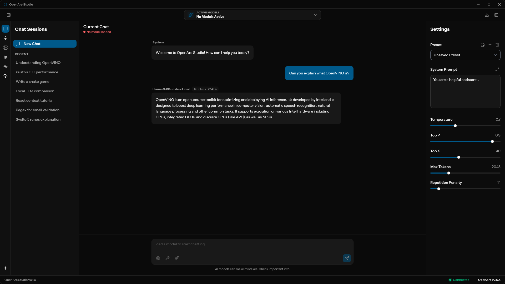

</details>

<details>
<summary>Models & Downloader</summary>

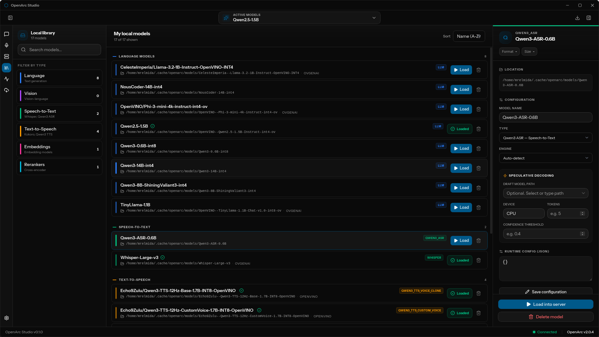
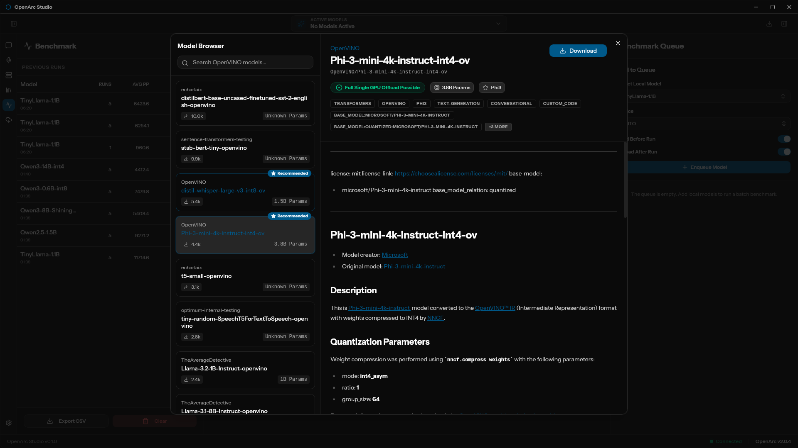

</details>

<details>
<summary>Server Management</summary>

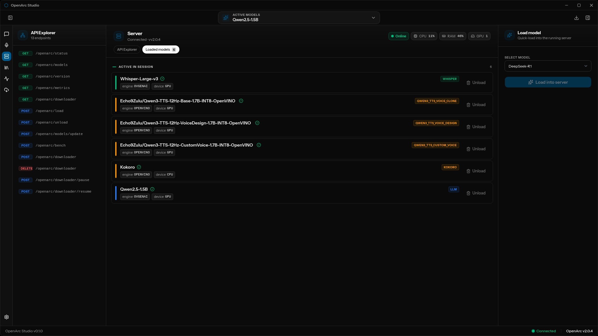
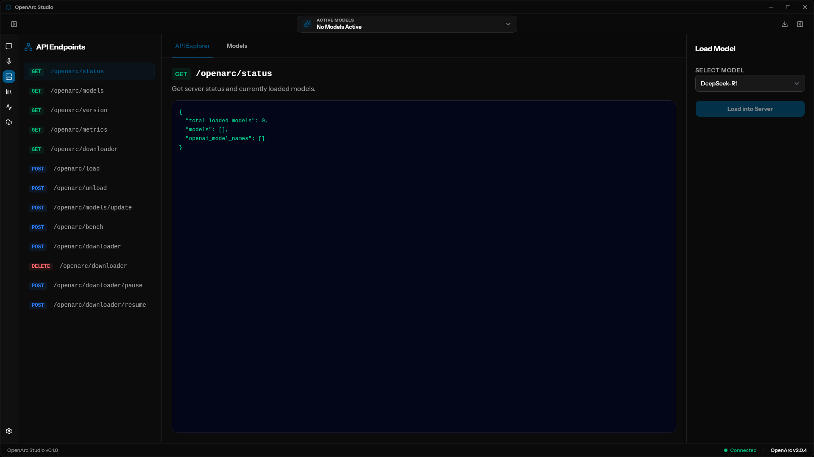

</details>

<details>
<summary>Benchmark Tool</summary>

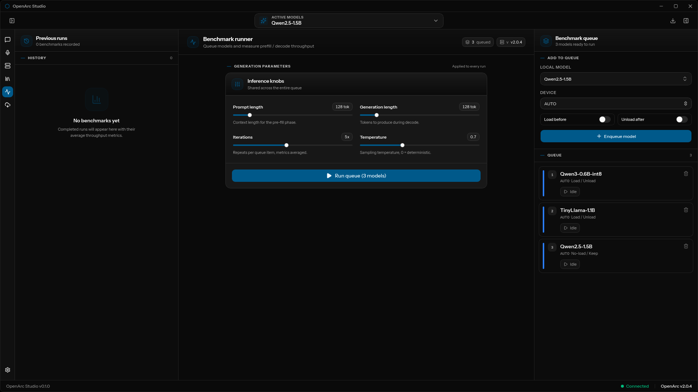
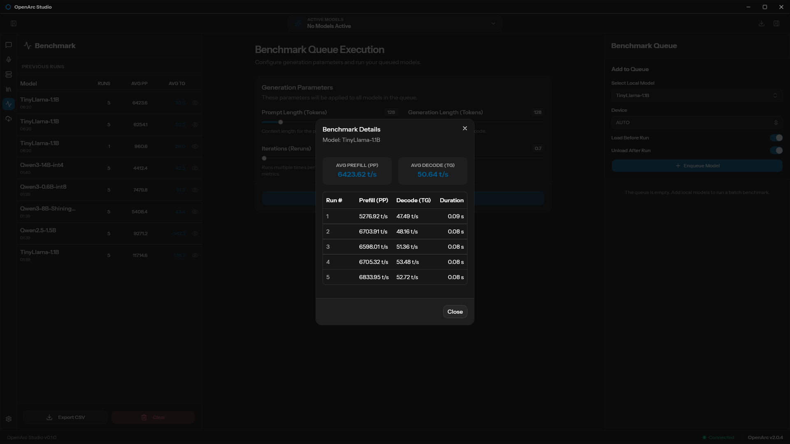

</details>

<details>
<summary>Settings & Stats</summary>

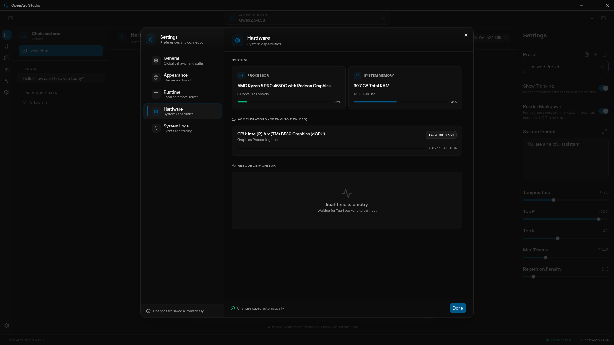
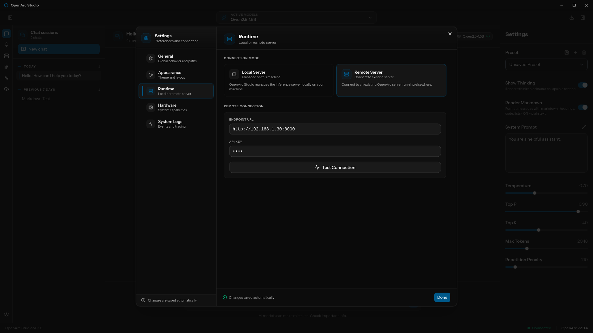
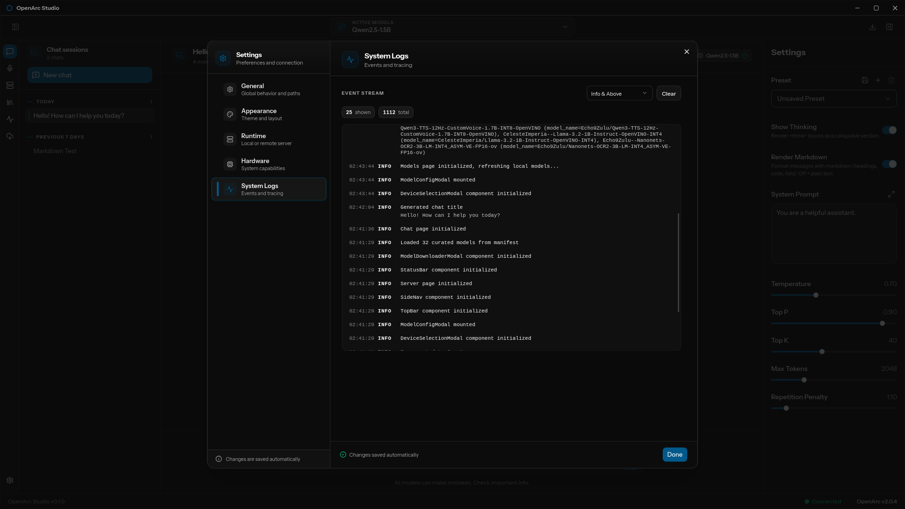

</details>

<details>
<summary>Voice Studio</summary>

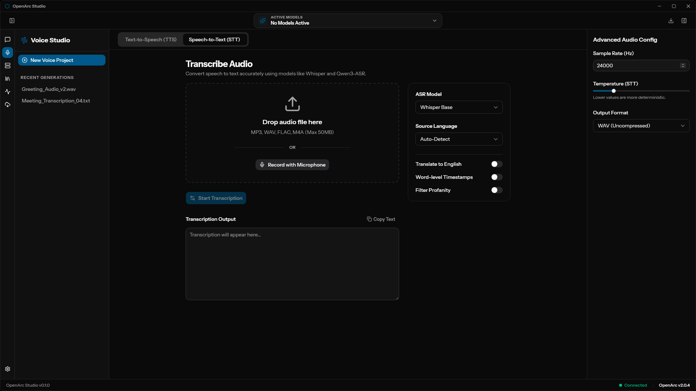
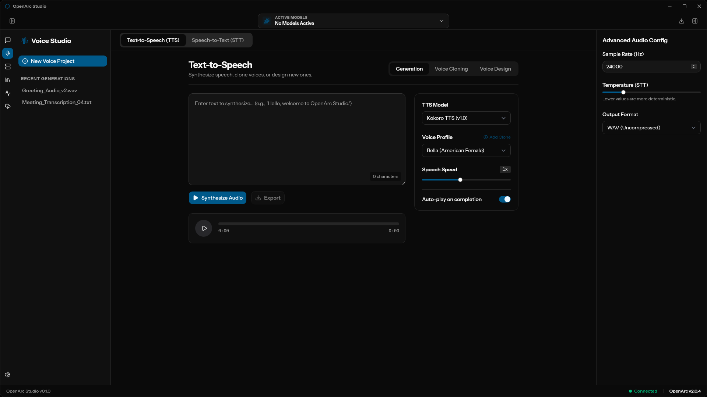
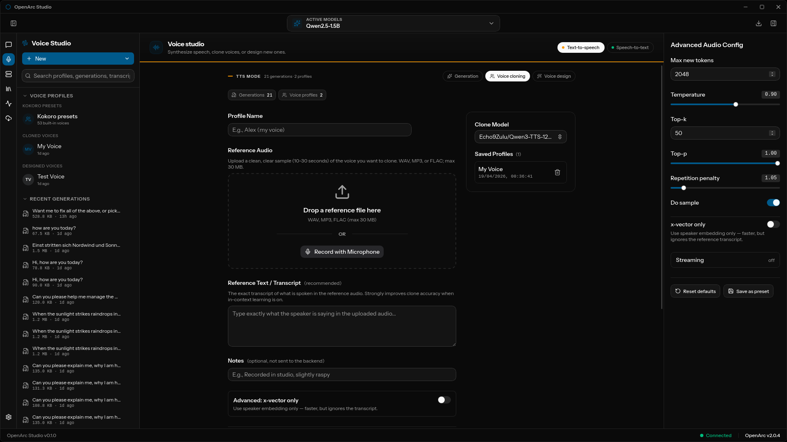
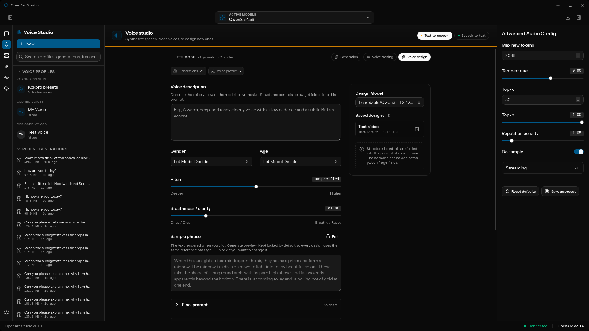

</details>

---

### Building from Source

You'll need a few things installed before you can build the app:

- [Bun](https://bun.sh) — used instead of npm/yarn
- [Rust](https://rustup.rs) — needed for the Tauri backend (stable toolchain is fine)
- The usual Tauri system dependencies for your OS — [check the Tauri docs](https://v2.tauri.app/start/prerequisites/) if you're not sure what's missing
- `libfuse2` — required on Linux for the AppImage bundler (`sudo apt install libfuse2` on Debian/Ubuntu)
- `appimagetool` — required for creating AppImages. Tauri tries to download it automatically, but if that fails you can grab the prebuilt AppImage from [AppImage/appimagetool](https://github.com/AppImage/appimagetool/releases) and extract the binary to somewhere in your `PATH` (e.g. `~/.local/bin/`)

Once you have those, it's pretty straightforward:

**Linux users:** run `./build.sh` to handle distro-specific checks and fixes automatically:

```bash
./build.sh
```

**Or do it manually:**

> [!IMPORTANT]
> On rolling-release distros like Arch Linux, the `strip` binary bundled inside `linuxdeploy` is too old to handle modern ELF `.relr.dyn` sections. If AppImage bundling fails with `failed to run linuxdeploy`, build with `NO_STRIP=1`:
> ```bash
> NO_STRIP=1 bun run tauri build
> ```

**1. Clone the repo and install frontend dependencies**
```bash
git clone --recursive https://github.com/SearchSavior/openarc-studio
cd openarc-studio
bun install
```

**2. Run in dev mode** (hot reload, opens the app window)
```bash
bun run tauri dev
```

**3. Or build a distributable binary**
```bash
bun run tauri build
```

The output ends up in `src-tauri/target/release/bundle/`. On Linux you'll get an AppImage and a .deb. On Windows you'll get an .msi and an NSIS installer.

> [!NOTE]
> The first build takes a while because Cargo has to compile all the Rust dependencies. Subsequent builds are much faster.

---

### Short-term to do list
- Add buttons to actually start/stop the local server from the UI, plus a view for the console logs (this will be implemented when the local server setup process is implemented)
- A fully functional download manager (with pause/cancel and progress bars (do not work perfectly))
- Make the app automatically find OpenVINO models you already have on your hard drive
- Basic desktop app stuff (a hardware resource monitor (half implemented), making external links open in your browser)
- Voice feature: recording from your mic
