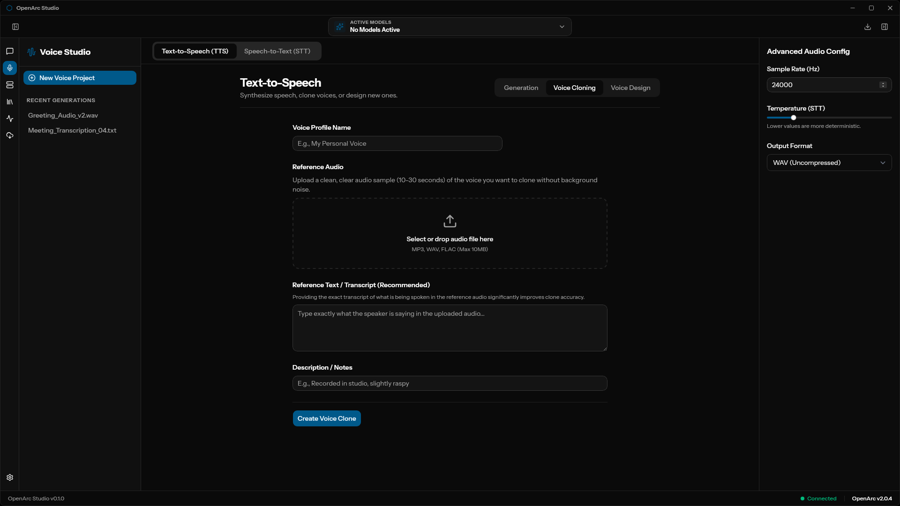

# OpenArc Studio

This is a GUI app for managing an OpenArc instance. Basically, it lets you use OpenArc without having to deal with the terminal.

> [!IMPORTANT]
> The setup process to install a local OpenArc server isn't included yet. For now, you need to connect to an OpenArc server that's already running.

### Screenshots

*Note: For the screenshots below, keep in mind that the **Voice Studio** and **Chat** are just UI mockups for now and are not functionally implemented yet. The rest of the features shown are currently half-implemented or in active development.*

#### Chat

#### Models & Downloader

#### Server Management

#### Benchmark Tool

#### Settings & Stats

#### Voice Studio

---

### Short-term to do list
- Add buttons to actually start/stop the local server from the UI, plus a view for the console logs
- A real download manager (with pause/cancel and progress bars)
- Make the app automatically find OpenVINO models you already have on your hard drive
- Basic desktop app stuff (saving your settings, a hardware resource monitor, making external links open in your browser)
- Voice features: recording from your mic, text-to-speech, and custom voice cloning
- Chatting features: it's not working yet :)